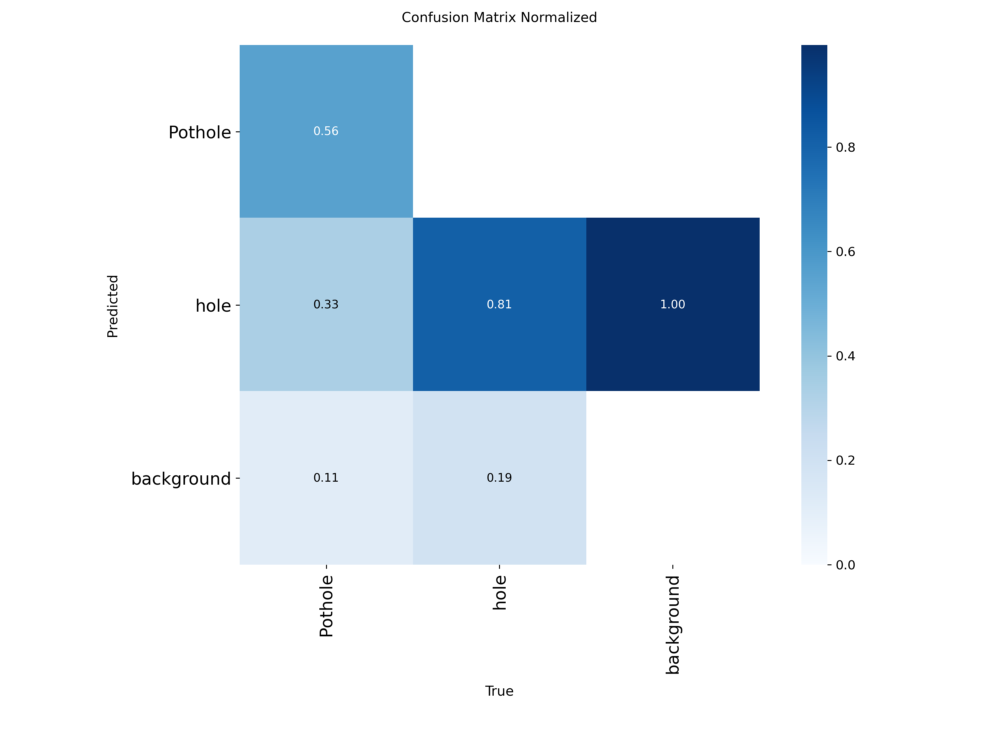
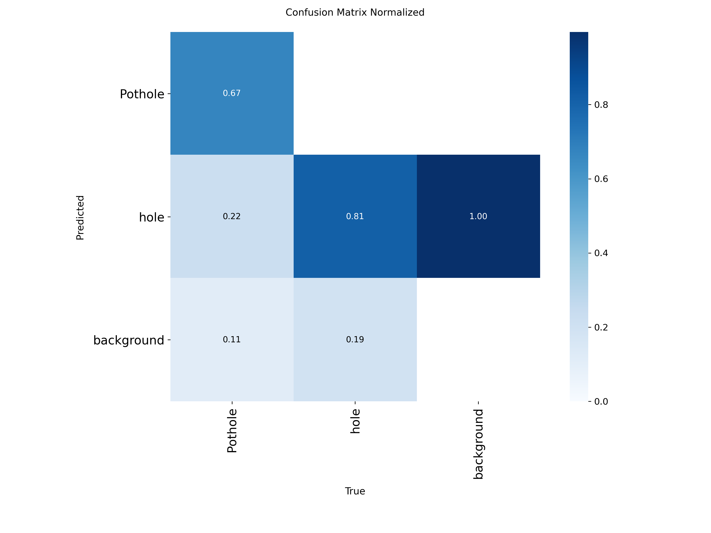
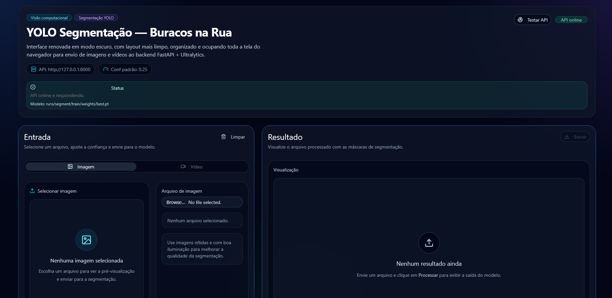
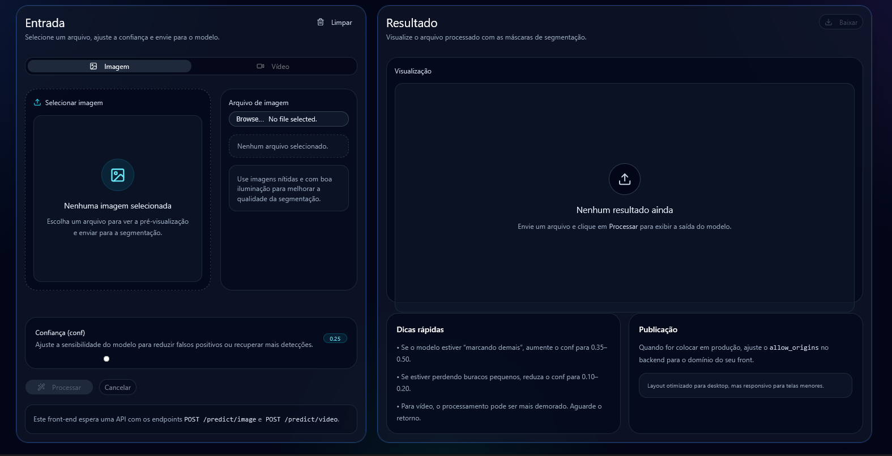
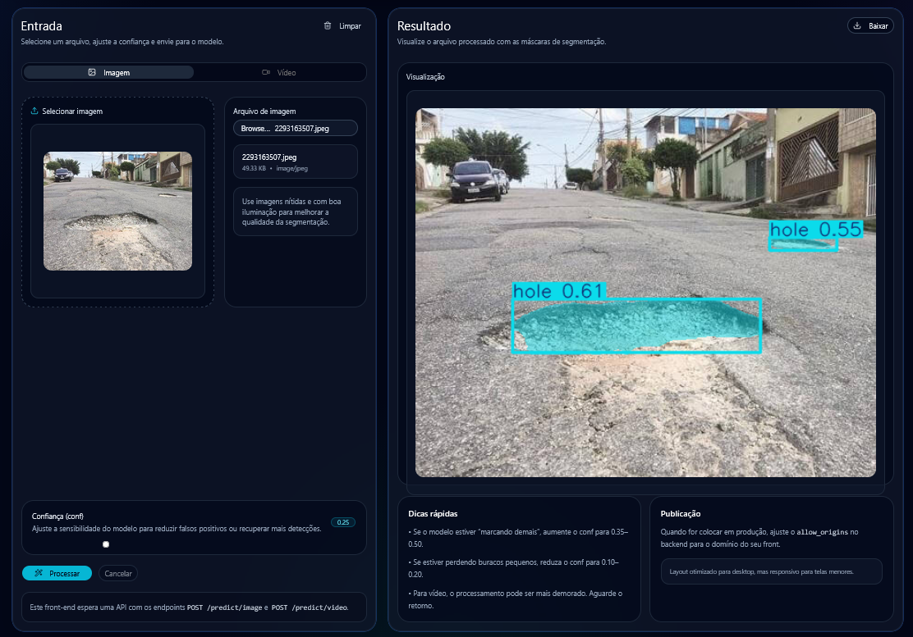

# Segmentação de Instâncias para Detecção de Buracos em Vias Públicas 🚗🔍

Este projeto foi desenvolvido como requisito avaliativo para a disciplina de **Introdução à Inteligência Artificial** do curso de graduação em **Inteligência Artificial** da **Fatec de Rio Claro**, sob a orientação do **Professor Davi Duarte de Paula**.

---

## 📌 Objetivo do Trabalho
O objetivo principal deste projeto é aplicar técnicas de Visão Computacional para identificar de forma automatizada imperfeições na malha rodoviária (buracos). Utilizando modelos de **Segmentação de Instâncias**, o sistema não apenas detecta a presença da falha, mas delineia o contorno exato do problema, permitindo futuramente mensurar a área afetada para auxiliar órgãos de manutenção urbana.

---

## 🏗️ O que é o Trabalho?
A aplicação consiste em uma solução de IA de ponta a ponta que engloba:
1. **Modelo de Deep Learning:** Utilização da arquitetura estadual da arte **YOLOv8** (especificamente o modelo pré-treinado `yolov8n-seg.pt` focado em segmentação).
2. **Backend (API):** Desenvolvido em **FastAPI** para gerenciar as requisições, receber imagens e vídeos e processar a inferência do modelo de IA de forma rápida.
3. **Frontend (Interface Web):** Uma interface gráfica moderna, responsiva e em *Modo Escuro (Dark Mode)*, onde o usuário pode enviar arquivos, ajustar a barra de sensibilidade (confiança) do modelo em tempo real e visualizar o resultado segmentado na tela.

---

## 📊 Dataset (Origem e Tratamento)
* **Origem:** O dataset foi coletado e exportado através da plataforma **Roboflow**, contendo imagens reais de ruas e rodovias com falhas asfálticas.
* **Classes originais:** `Pothole` (buracos grandes) e `hole` (buracos comuns).

---

## 🚀 Ambiente de Treinamento e Validação

Dado o peso computacional de treinar uma rede neural convolucional para segmentação, o treinamento foi portado e executado com sucesso em ambiente de nuvem no **Google Colab** utilizando aceleração por hardware de uma GPU dedicada **NVIDIA Tesla T4**.

### Parâmetros de Treino:
* **Modelo Base:** `yolov8n-seg.pt`
* **Épocas:** 50
* **Tamanho da Imagem (imgsz):** 640x640 pixels
* **Batch Size:** 32 (otimizado para a GPU do ambiente)
* **Tempo total de processamento:** ~1.215 horas (1h 13min)

---

## 📉 Análise dos Resultados

A validação do modelo gerou as seguintes métricas de desempenho:

* **Classe Pothole:** Alcançou excelentes taxas de sensibilidade (**67%** de acerto direto no contorno de buracos volumosas). Por ser uma classe com pouca amostragem no dataset (apenas 9 instâncias de teste), o resultado foi considerado muito satisfatório para um modelo *Nano*.
* **Classe hole:** Apresentou uma capacidade massiva de encontrar os alvos (Sensibilidade/Recall de **81%**). 
* **Falsos Positivos (Oportunidade de Melhoria):** A matriz de confusão indicou que o modelo inicial se mostrou "empolgado demais", confundindo texturas irregulares de asfalto, sombras ou emendas com buracos (gerando um volume alto de falsos positivos contra o *Background*). 
* **Solução Prática Aplicada:** O problema foi mitigado diretamente na aplicação ao ajustar o slider de confiança do frontend de `0.25` para `0.35`~`0.40`. Isso filtrou ruídos visuais e gerou segmentações limpas e altamente confiáveis.

<div align="center">

### Matriz de Confusão Treinamento


### Matriz de Confusão Validação


</div>

---

## 📸 Demonstração do Projeto em Funcionamento

Nesta seção estão os registros visuais da aplicação final recebendo uma imagem de teste real e aplicando as máscaras de segmentação com sucesso através da API.

<div align="center">

### Interface Principal




### Resultado da Segmentação em Tempo Real (Confiança Ajustada)


</div>

---

## 💻 Como Rodar o Projeto na Sua Máquina

### 1. Pré-requisitos
Certifique-se de ter o **Python 3.10+** instalado no seu computador.

### 2. Instalação das Dependências
Instale as bibliotecas necessárias abrindo o terminal na pasta raiz do projeto e executando:
```bash
pip install ultralytics fastapi uvicorn python-multipart

```
### 3. Backend:
Para ativar o back no terminal digite: 
```bash
pip install fastapi uvicorn ultralytics python-multipart
python -m uvicorn api:app --reload
```
## 4. Frontend: 
Para ativar o front no terminal:
```bash
cd frontend
npm install
npm run dev
```
